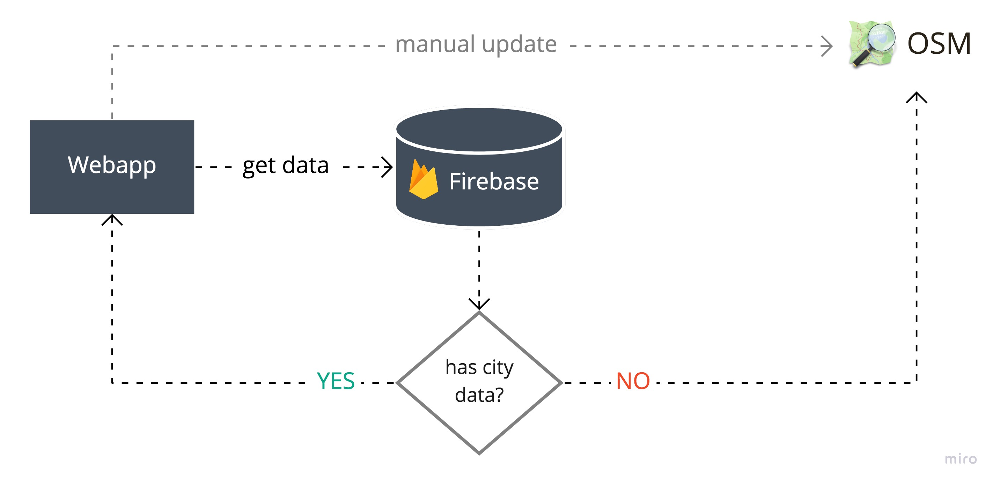

# CicloMapa

## An open platform to democratize access to bike maps of brazilian cities, combining the collaborative power of  with web technologies and easy-to-use design.

Today in Brazil we face a big challenge of not having data on the cycling infrastructure available in our cities. This makes it very hard to paint a clear picture of our reality and calculate the relevant metrics to measure the opportunities and impacts to society of improving urban mobility. The most common problems are data not being standardized, making it hard to compare between localities, data not being available publicly or sometimes it not existing at all.

[UCB (Brazil Cyclists Union)](https://www.uniaodeciclistas.org.br) and [ITDP (Transport and Development Policy Institute)](https://itdpbrasil.org/) are two civil society organizations that have joined forces to solve once and for all the problem of access to data on Brazil's cycling infrastructure.

We've developed the first cycling maps platform encompassing all Brazilian cities, leveraging the data and collaborativity of [OpenStreetMap (OSM)](https://www.openstreetmap.org/), the biggest initiative of this kind. We've created an open-source web application, free and accessible from any computer or smartphone, aimed at both the average citizen who wants to know more about their city, and researchers, who will have easy access to data without needing OSM knowledge.


📕 [Full case study](https://cristianodalbem.com/ciclomapa/)

🎓 [UCB website with more useful links and tutorials on OSM](https://www.uniaodeciclistas.org.br/atuacao/ciclomapa)


## Main features

- **Easily visualize** the different kinds of cycling structure of any brazilian city. We simplified all the technical details of OSM so everyone can understand it.
- **Learn** about what are the main types of cycling structures you can find around. Semantic colors help you remember that some are better than others.
- **Download the GeoJSON data** with a single button click so you can import in your favorite GIS application and power up your research analysis.
- Found something wrong? A **direct link** will take you to the OSM web editor so you can fix it and contribute.


## Architecture

The basic premise is that the OSM Overpass API is *very* slow and we couldn't hit it directly without damaging a lot the user experience. However, differently than other similar projects, we didn't want to have data stuck in time, since we want contributors to be continually improving the data.

We store a mirror of the OSM data in a Firebase Database. Any user (possibly an OSM contributor) can manually update this data, which will automatically update the Database.




# Getting started

> This project was bootstrapped with [Create React App](https://github.com/facebook/create-react-app), so if you're familiar with the tool you're already know all these commands.


To clone the repository and install everything:

```
git clone git@github.com:cmdalbem/ciclomapa.git
cd ciclomapa
yarn install
```

## Using

To start the local server:

```
yarn start
```

To deploy to production server:

```
yarn run deploy
```


## Contributing

Thanks for considering contributing to CicloMapa!

Check out our [Contribution Guide](.github/CONTRIBUTING.md).


## Contact

<contato@ciclomapa.org.br>


## License
The source code is available under a [GPLv3 license](https://github.com/cmdalbem/ciclomapa/blob/master/LICENSE).

Data is directly imported from [OpenStreetMap®](https://www.openstreetmap.org/) and thus is open data, licensed under the [Open Data Commons Open Database License (ODbL)](https://opendatacommons.org/licenses/odbl/) by the [OpenStreetMap Foundation (OSMF)](https://osmfoundation.org/).
